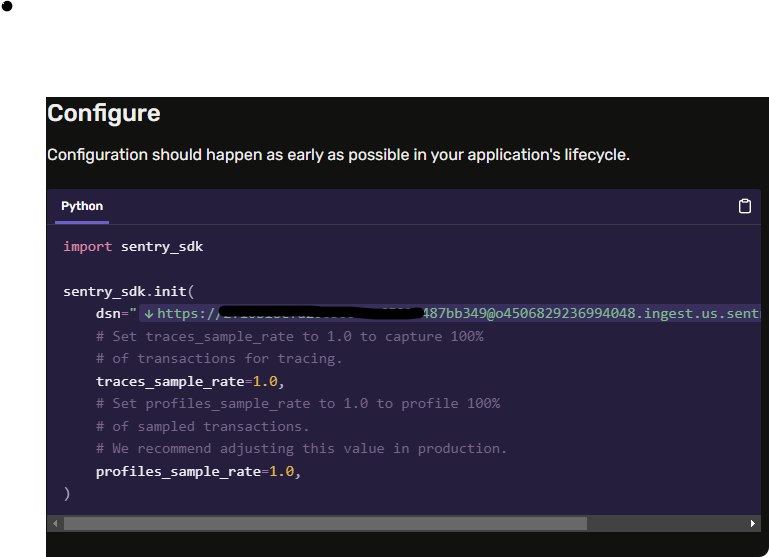
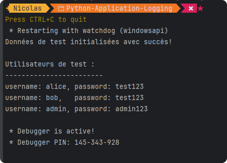

# Application Log with Sentry Saas

# Prérequis

- Avoir un compte sur [Sentry Saas](https://sentry.io/)
- Créer un projet sur Sentry Saas
- Récupérer la clé d'API de votre projet
- Lire la doc!
    - https://docs.sentry.io/platforms/python/

## Description

Une simple application en Python pour découvrir le fonctionnement de Sentry Saas.
L'application est fonctionnelle et sert uniquement à découvrir comment on peut utiliser Sentry Saas pour gérer les logs d'une application.

## Installation

1. Cloner le projet

2. Installer les dépendances
```bash
pip install -r requirements.txt
```

3. Configurer l'application avec la clé d'API de votre projet Sentry


4. Lancer l'application
```bash
python main.py
```



